<div align="center">

<a href="https://pauljonadev.github.io/planeta-basket/">
  
</a>

### Más pulseras en tu carrito, menos dinero en tu cuenta.

**Planeta Basket** es una tienda online de accesorios de baloncesto con descuentos que crecen a medida que armas tu pack: pulseras de silicona en alto relieve, pulseras trenzadas, mangas de compresión y medias.

<br>

<a href="https://pauljonadev.github.io/planeta-basket/">
  
</a>

<br><br>


<br>

[🎯 La idea](#-la-idea) · [✨ Qué ofrece](#-qué-ofrece) · [💸 Descuentos](#-descuentos-por-volumen) · [🧰 Stack](#-stack-tecnológico) · [🚀 Ejecutarlo](#-ejecutarlo-en-local)

</div>

<br>

<details>
<summary><b>👆 Haz clic: ¿cómo se compra en 3 pasos?</b></summary>

<br>

1. 🏀 **Elige tus pulseras** en el catálogo o arma tu pack.
2. 🛒 **Agrégalas al carrito lateral**, que se desliza sin sacarte de la página.
3. 📉 **Mira bajar el precio:** cuantas más pulseras sumas, mayor es el descuento, hasta llegar al envío gratis.

</details>

<br>

---

## 🎯 La idea

Una pulsera sola es una compra pequeña. Cinco pulseras son una compra grande, y quien juega al baloncesto casi nunca quiere solo una: quiere la de su jugador favorito, la de su equipo y una para regalar.

Planeta Basket está diseñada alrededor de esa idea. En lugar de bajar precios de forma plana, el descuento **sube con cada unidad** y le muestra al cliente cuánto le falta para el siguiente nivel. Es una estrategia de **Conversion Rate Optimization (CRO)** basada en compras por volumen (*Pick & Mix*) y combos de alto valor percibido.

**Público:** jugadores de streetball, ligas locales y academias, y fanáticos de la cultura basket y NBA.

---

## ✨ Qué ofrece

| Función | Beneficio |
|---|---|
| 🛒 **Carrito lateral deslizable** | Compras sin salir de la página, con cantidades editables y subtotal automático |
| 📦 **Descuentos progresivos** | Cada pulsera extra baja el precio, y el cliente lo ve en tiempo real |
| 🚚 **Barra de progreso de envío gratis** | Muestra cuánto falta para desbloquear el envío sin costo |
| 🎁 **Combos listos** | Packs de leyendas, *Ready to Play* (pulsera + manga + medias) y *Dúo de Cancha* |
| 🌑 **Estética urbana en modo oscuro** | Alto contraste inspirado en el streetball, pensada primero para el celular |

---

## 💸 Descuentos por volumen

| Pulseras en el carrito | Descuento |
|:---:|:---|
| **2** | 🔵 15% OFF |
| **3** | 🟠 20% OFF |
| **5** | 🔥 35% OFF **+ envío gratis** |

---

## 🧰 Stack tecnológico

| Capa | Tecnología | Uso en el proyecto |
|:---|:---|:---|
| **Frontend** | React 18 + Vite | Interfaz modular por componentes y desarrollo rápido |
| **Estilos** | Tailwind CSS | Sistema de diseño responsivo, mobile-first |
| **Estado global** | React Context API | Estado centralizado del carrito de compras |
| **Backend** | Node.js + Express | API REST para el catálogo y las reglas de negocio |
| **Versiones** | Git / GitHub | Control de cambios y publicación del código |

> **Nota sobre el demo:** GitHub Pages solo sirve sitios estáticos, así que la demo en línea corresponde al **frontend**. El backend se ejecuta en local.

---

## 📁 Estructura del proyecto

```text
planeta-basket/
├── backend/                  # Servidor de API REST (Node.js + Express)
│   ├── controllers/          # Lógica de controladores de la API
│   ├── routes/               # Enrutamiento de endpoints
│   └── server.js             # Punto de entrada del servidor
│
├── frontend/                 # Aplicación cliente (React + Vite)
│   ├── public/               # Assets estáticos y fotos de productos
│   ├── src/
│   │   ├── components/       # Header, HeroBanner, BundleBuilder, ProductGrid, CartDrawer
│   │   ├── constants/        # Datos estáticos (products.js)
│   │   ├── context/          # Estado global del carrito (CartContext.jsx)
│   │   ├── App.jsx           # Componente principal
│   │   └── main.jsx          # Renderizado inicial de React
│   ├── package.json
│   └── vite.config.js
│
└── img/                      # Banner del README
```

---

## 🚀 Ejecutarlo en local

```bash
git clone https://github.com/PaulJonaDev/planeta-basket.git
cd planeta-basket
```

**Frontend**

```bash
cd frontend
npm install
npm run dev
# abre la URL que muestra la terminal (normalmente http://localhost:5173)
```

**Backend** *(en otra terminal)*

```bash
cd backend
npm install
node server.js
```

---

## 🔭 Siguientes pasos

- [ ] Conectar el frontend desplegado a un backend publicado
- [ ] Guardar el carrito para que no se pierda al recargar la página
- [ ] Pasarela de pago para cerrar la compra

---

<div align="center">

Hecho por **Jonathan David Paul Caraballo** · [GitHub](https://github.com/PaulJonaDev) · [LinkedIn](https://www.linkedin.com/in/pauljonadev)

</div>
